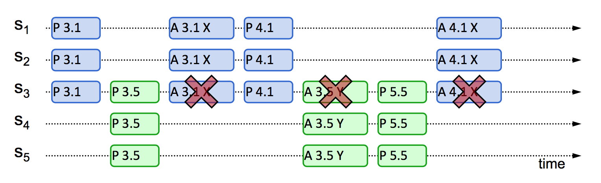

Paxos is the distributed consensus algorithm that started it all. First published by Leslie Lamport in his seminal paper, *The Part-Time Parliament*, and later dissected for the masses in his publication *Paxos Made Simple*, the algorithm attempts to solve for consensus while striking a balance between maximizing availability (the protocol will not block on node failures, and will continue to run as long as a quorum can be reached) and guaranteeing strong consistency. 

## The Algorithm

Paxos in its basic form tackles the problem of consensus on a single value. The algorithm executes over two phases, with participating nodes assuming one or both of these two roles:

- **Proposers**: active agents that receive requests from clients and propose values.
- **Acceptors**: passive agents that receive requests and vote for values.

For simplicity's sake, assume every node on our network executes both roles. 

### Phase 1: Prepare

Proposers send PREPARE requests to Acceptors with a **proposal number** attached. This number is extremely important, as it is used to establish a hierachy and an absolute ordering amongst the proposals. Therefore, the number must be unique and greater than that of any past proposals.

If the proposal number is not the highest that the Acceptor has seen, it will tell the Proposer that the proposal is no longer valid. Otherwise the Acceptor will return a flag signifying the proposal is still valid, as well as communicate the latest accepted values (if any). 

The Proposer will proceed to the second phase if a majority of Acceptors respond that the proposal is valid. If the Proposer is returned any accepted proposals, it will attempt to propogate the value of the latest accepted proposal.

```python
# Proposer
def broadcast_prepare_requests(
    self,
    proposal: Proposal
) -> List[PrepareResponse]:
    return [
        client.send_prepare_rpcs(proposal)
        for acceptor in self.acceptors
    ]

# Acceptor
def process_prepare_request(
    self,
    proposal: Proposal
) -> PrepareResponse:
    if proposal.proposal_num > self.highest_proposal_num_seen:
        self.highest_proposal_num_seen = proposal_num
        return PrepareResponse(
            valid=True,
            accepted_proposal=self.highest_accepted_proposal
        )
    return PrepareResponse(valid=False, accepted_proposal=None)
```

### Phase 2: Accept

Proposers send ACCEPT requests to Acceptors containing a proposal number and value. Acceptors will respond favorably if the attached proposal number is the highest it has seen thus far. Else, it will reject the proposal.

If the Proposer has received successes from a majority of Acceptors, it considers consensus to be reached on that value. Otherwise, it will enter back into Phase 1 with a new proposal number.

```python
# Proposer
def broadcast_accept_requests(    
    self,
    proposal: Proposal
) -> List[AcceptResponse]:
    return [
        self.client.send_accept_rpcs(proposal)
        for acceptor in self.acceptors
    ]

# Acceptor
def process_accept_request(
    self,
    proposal: Proposal
) -> AcceptResponse:
    if proposal.proposal_num >= self.highest_proposal_num_seen:
        self.highest_accepted_proposal = proposal
        return AcceptResponse(accepted=True)
    return AcceptResponse(accepted=False)
```

### Livelock & Other Concerns

> The consensus problem involves an asynchronous system of processes, some of which may be
unreliable. The problem is for the reliable processes to agree on a binary value. (...) it is shown
that every protocol for this problem has the possibility of nontermination, even with only one faulty
process.

In accordance with [FLP's impossibility result](https://dl.acm.org/doi/pdf/10.1145/3149.214121), Paxos will only guarantee **validity** (nodes will only learn of proposed values) and **consistency** (nodes will only agree on a single value), eschewing **liveness** (the guarantee to terminate).

**Livelock** occurs when proposers constantly one-up each other with proposals of a higher round number, before a quorum is reached for the previous proposal.



In the above diagram you can see that P 3.1 does not manage to achieve a quorum before P 3.5 reaches a majority of nodes. A higher proposal number will trump a lower one, so P 3.1 cannot acheive quorum in this state. The same thing happens to P 3.5 with P 4.1, and then again with P4.1 and P 5.5. This can go on indefinitely.

Luckily, there are many solutions to livelock out there (e.g. adding randomized delay between phases, or in the case of Multi-Paxos, leader election).

Another concern with Paxos is that only the Proposer is aware when consensus is reached. Other nodes will need to learn of that knowledge one way or another, which will involve even more RPCs and general overhead.

## Multi-Paxos

One of the prevalent use cases of Paxos is to replicate a state machine. This is done by replicating a sequential log of operations, which will be applied by each node. Multi-Paxos is a refinement of Basic Paxos that optimizes for this use case.

### Leader Election

To make repeating Paxos more efficient, a single Proposer is to be made "leader", which will be responsible for all future proposals. When the leader confirms it's up to date with a majority of Acceptors (no more accepted values returned), it no longer needs to send PREPARE requests, and can send just ACCEPT requests for proposals. This effectively halves the amount of RPCs that is needed for a round of Paxos, and our system will retain this benefit until the leader fails. 

### Leader Failure

In the case of leader failure, Multi-Paxos gracefully degrades into the Basic Paxos protocol. We can allow the Proposer that first completes the next PREPARE phase to assume leadership. We do not have to worry about multiple nodes that believe that they are leaders, as that is supported by Paxos.

## In Summary

Paxos allows a network of nodes to reach consensus on a single value, while guaranteeing that the value is valid and consistent. Multi-paxos allows consensus to be reached on a sequence of values, while attempting to minimize the number of RPCs needed to do so. When tackling consensus in a system that requires strong consistency and high availability (e.g. do not block if a node is down), Paxos is a worthy consideration.