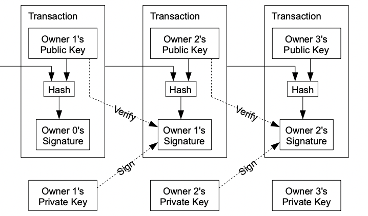

## Introduction

Ethereum. Bitcoin. Ripple.

Once heavily affiliated with hacker subculture and the dark web, cryptocurrency has become increasingly mainstream in the past decade. Nowadays applications such as Robinhood or Cash App allow just about anybody to buy into the crypto hype. 

But what exactly is cryptocurrency? Can a purely electronic tender be secure and trusted enough for widespread adoption? Satoshi Nakamoto demonstrates his vision of an ideal electronic currency in his whitepaper *Bitcoin: A Peer to Peer Electronic Cash System*.

## Electronic Coins

Nakamoto lays the first principles of cryptocurrency by providing a definition for an electronic coin: *a chain of digital signatures*. Distilled into simpler terms, he posits that a coin can be represented as a history of its past transactions.

Each transaction requires the coin's current owner to sign it with their private key, the cryptographic equivalent of a [hanko stamp](https://en.wikipedia.org/wiki/Seal_(East_Asia)). Anyone can then [verify the transaction mathematically](https://en.wikipedia.org/wiki/Public-key_cryptography) using the signature and the previous owner's public key.

But even with the powerful ability to verify transactions cryptographically, [double spending](https://en.wikipedia.org/wiki/Double-spending) is still a looming issue. There needs to be a guarantee that subsequent attempts to spend a spent coin will always be rejected.

To solve for double spending, Satoshi suggests that the system requires transactions to be publicly announced. All nodes will be aware of all transactions. But given the fact that network faults are unavoidable, the initially straightforward solution becomes a magnitude more complex, with nodes needing to eventually align with one another on a single transaction history: a problem of consensus. 

Consensus amongst collaborative nodes is hard enough; consensus amongst selfishly-motivated nodes, all while keeping the network's shared transaction history safe from attacks, seems like a fool's task. 

For this complex issue, Nakamoto provides an elegant solution, an innovation that will surely be remembered as one of the critical distributed system breakthroughs of the 21st century: the blockchain.

## The Blockchain

The blockchain, in the context of Bitcoin, is a public, distributed ledger. 

A block in the blockchain encapsulates a set of transactions, serving as a timestamp to the happenings of those transactions. Blocks in the chain come together to form a database containing information about every valid transaction that has occurred.

Each node is incentivised with money to want to be the one to append the next block to the blockchain. To decide which node gets that privilege, the blockchain employs a vote-by-compute-power mechanism.

#### Consensus Protocol Steps
- The node creates a block, loading it up with some number of pending transactions.
- All nodes compete to be the first to finish a CPU intensive “proof-of-work” problem. This problem is dependent on the node’s proposed block, and the latest block on the blockchain, as inputs. Each block influences the solution of the next block’s proof of work problem, which means that subsequent blocks in the chain help reinforce all previous blocks. 
- When the node completes the proof-of-work problem, they broadcast the block with the answer to all nodes in the network.
- If a node receives a solution broadcast, it will attempt to verify the transactions on the block with the answer. If valid, the node will acknowledge the answer by appending the solution block to its local blockchain copy, and restart at Step 1.

## Incentives

Solving proof-of-work problems requires a staggering amount of CPU power and electricity. There are two main incentives as to why nodes compete to solve these problems. 

First, each block contains a special transaction as its first transaction, one which creates a set amount of coins for the block’s creator. Earning coins by getting your block chosen is what people refer to when they talk about “mining” Bitcoins. This mechanism also serves as a means to introduce new coins into circulation.

Second, each transaction can optionally provide a transaction fee, an incentive for miners to include the transaction on their block. The amount of coins mined per block is set to slowly decrease as time goes on, designed to eventually reach zero when a set amount of coins are in circulation. Transactions fees are expected to become the main incentive driver when that eventuality occurs.

## Proof-of-work

By design, nodes consider the longest blockchain as correct as length is a direct representation of the amount of CPU power that was invested. The result of a system backed by proof-of-work is that the blockchain is safe from attackers so long as honest nodes hold a simple majority of compute power. 

Consider the case where an attacker tries to defraud a node by double spending a coin. When the attacker removes his transaction from its block, the block’s value changes, which requires a redoing of the block’s proof of work problem, as well as the proof-of-work problems in all subsequent blocks. 

All the while, honest nodes are investing all their CPU power to extend their version of the blockchain. These factors make any attempts to overtake the “good” blockchain a truly sisyphean task.

## In Conclusion

The traditional banking model operates on a trust based system, where a trusted third party (e.g. the bank) is tasked with moderating transactions. A trust based model will always have problems in terms of security and privacy, but with the advent of the internet and online banking, these already pronounced issues have only gotten worse.

Cryptocurrency looks to reinforce transactions with something tangible: proof-of-work. The validity of each transaction is secured through mathematical means, which means that personal information is not required as a safeguard against fraud. Transactions will be held between anonymous parties.

New problems require new solutions, not old ones. In this digital age, Satoshi Nakamoto pioneered a path towards a safer, reliable, and more secure future.

*To learn more, read the whitepaper [here](https://bitcoin.org/bitcoin.pdf).*