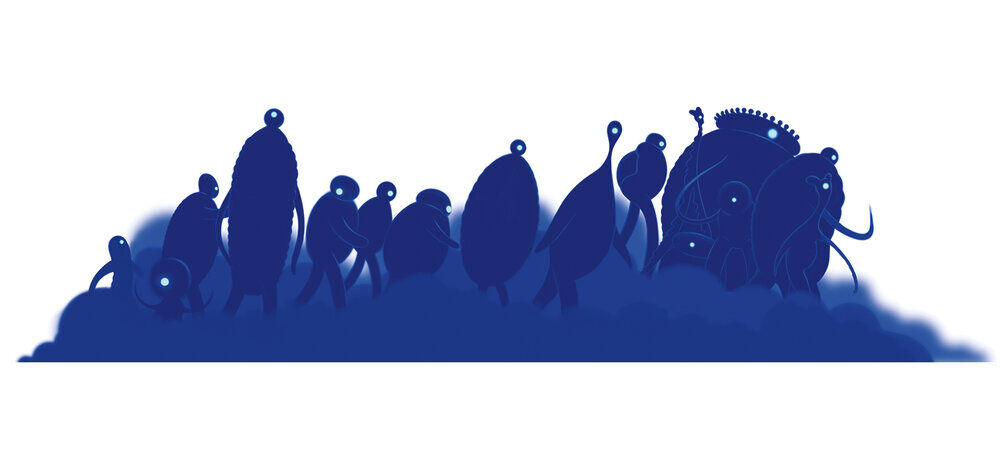

>“I heard this story about a fish, he swims up to an older fish and says: ‘I’m trying to find this thing they call the ocean.’ ‘The ocean?’ the older fish says, ‘that’s what you’re in right now.’ ‘This’, says the young fish, ‘this is water. What I want is the ocean!’” – from the movie, **Soul**

Dorothea Williams steps into the cab and departs, leaving Joe Gardner with the wind and a confusing story-bordering-on-parable about fish as company. As the last bits of adrenaline from performing on stage exits Joe's system, the nervous buzz of excitement is replaced with a gnawing sense of apathy. 

In the aftermath of having his wildest dreams and aspirations realized, Joe is grappling with the absence of fulfillment. And as he comes to terms with his troubled emotions, the didactic story of the old fish and the young fish continues to swim around ever present in his thoughts.

## This Is Water

The story that Dorothea imparts on Joe makes it clear that the themes in the latest Pixar animation *Soul* takes some inspiration from ["This Is Water"](https://fs.blog/2012/04/david-foster-wallace-this-is-water/), a commencement speech by the late David Foster Wallace.

#### By Default

From birth each human will continually accumulate unique experiences through the lens of self. As we grow older, is it not surprising then that each of us gravitates toward a notion that we are the center of the universe – after all it is only natural for individuals to be self-centric.

Throughout most of the movie, Joe demonstrates a life led through self worship, with his actions being largely egocentric (e.g. jaywalking with disregard for traffic as a celebration for landing the gig, refusing to accept his own death, disregarding 22's goals if they are unaligned with his own).

There are many other deities besides the self that individuals can come to worship by default, almost too many to count. David warns us that without an awareness of what we are worshiping, things we worship can easily eat us alive. 

In the movie, those eaten alive are personified as the lost souls of the spirit realm.

#### By Choice

Modern society does no part in hindering us from operating at our default settings; in fact, it encourages it. And though the worship of money and power, hallmarks of Capitalism each, has yielded great results in affording our country prosperity and liberty, true freedom lies in the mundane choice to be present in the moment, to be aware and choose how we process our day-to-day. 

22's outlook, during her quick stint possessing Joe's body, exemplifies this awareness. Not having been bogged down through a myriad of past life experiences through virtue of being an unborn soul, 22 is able to live in such a way so that she is able to appreciate every detail of what is happening to her. Each moment is a choice for her, a decision of what to worship.

>That is real freedom. That is being educated, and understanding how to think. The alternative is unconsciousness, the default setting, the rat race, the constant gnawing sense of having had, and lost, some infinite thing. – David Foster Wallace, in "This Is Water"

## The Is The Ocean

And that is the "capital-T Truth", as Wallace puts it. 

Life *before* death.

Like the old fish in the story, we need to be ever conscious of what is essential: that surrounded by water, we are already in the ocean.